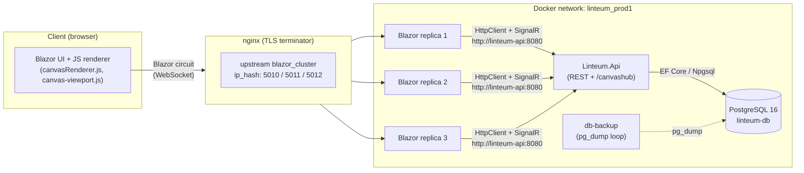

# 01 — Architecture

This document describes the static structure (layers, projects, data model) and the dynamic
behavior (request lifecycle, realtime fan‑out, background processing) of Linteum.

## 1. Layered structure

Linteum follows a classic layered .NET architecture with a shared contract assembly. All
projects target **`net10.0`**.

```
┌──────────────────────────────────────────────────────────────────────┐
│ Presentation                                                         │
│  Linteum.BlazorApp   (Blazor Server UI, JS canvas renderer)          │
│  Linteum.Bots        (automated HTTP clients)                        │
└───────────────┬──────────────────────────────────────┬───────────────┘
                │ HTTP + SignalR                        │ HTTP
                ▼                                       ▼
┌──────────────────────────────────────────────────────────────────────┐
│ Application / API                                                    │
│  Linteum.Api   (controllers, CanvasHub, background services, DI)     │
└───────────────┬──────────────────────────────────────────────────────┘
                │ depends on
                ▼
┌──────────────────────────────────────────────────────────────────────┐
│ Data access                                                          │
│  Linteum.Infrastructure  (AppDbContext, repositories, seeder,         │
│                           write coordinator, economy engine)          │
└───────────────┬──────────────────────────────────────────────────────┘
                ▼
┌──────────────────────────────────────────────────────────────────────┐
│ Domain              Contract                                          │
│  Linteum.Domain    (entities + repository interfaces)                 │
└───────────────┬──────────────────────────────────────────────────────┘
                ▼
┌──────────────────────────────────────────────────────────────────────┐
│ Shared               Linteum.Shared (DTOs, enums, Config, helpers)    │
└──────────────────────────────────────────────────────────────────────┘
```

| Project | Role | Referenced by |
|---|---|---|
| `Linteum.Shared` | DTOs, enums (`CanvasMode`, `BalanceChangedReason`, `LoginMethod`), `Config`, `CustomHeaders`, security and image/text helpers. The common vocabulary for every other project. | Everyone |
| `Linteum.Domain` | Entities (`Canvas`, `Pixel`, `User`, …) and repository interfaces (`IPixelRepository`, …). Pure domain contract, no EF references. | Infrastructure, Api, Tests.Db |
| `Linteum.Infrastructure` | EF Core `AppDbContext`, repository implementations, `CanvasWriteCoordinator`, `DbSeeder`, `HourlyCanvasIncomeProcessor`. Owns all data access. | Api, Tests.Db |
| `Linteum.Api` | ASP.NET Core Web API: REST controllers, the SignalR `CanvasHub`, hosted background services, migrations, DI composition root. | (host) |
| `Linteum.BlazorApp` | The web UI. Pure **Blazor Server** (Interactive Server render mode). Talks to the API via a server‑side `MyApiClient` and a second SignalR connection to `CanvasHub`. | (host) |
| `Linteum.Bots` | Console apps that act as ordinary HTTP clients against the API. | (optional) |

**Dependency rule:** dependencies point inward/downward. `Shared` depends on nothing in the
solution; `Domain` depends only on `Shared`; `Infrastructure` on `Domain` + `Shared`; the
hosts (`Api`, `BlazorApp`, `Bots`) depend on `Shared` and (where needed) `Domain`/`Infrastructure`.
The UI and bots never touch the database directly — they go through the API.

> **Migration placement note:** EF Core migrations live in `Linteum.Api/Migrations` (the
> `MigrationsAssembly` is configured as `"Linteum.Api"`), *not* in `Linteum.Infrastructure`,
> even though `AppDbContext` lives in Infrastructure. The Infrastructure `.csproj` declares an
> (empty) `Migrations\` folder, which is a leftover. See [Problems.md](Problems.md).

## 2. Component topology (runtime)



Two important properties of this topology:

1. **The browser never calls the API directly.** Because the UI is Blazor Server, all API
   calls (`MyApiClient`) and the `CanvasHub` SignalR connection originate on the **Blazor
   server**, not in the browser. The browser only holds the Blazor circuit (one WebSocket to
   nginx → a sticky Blazor replica). The Blazor server then reaches the API over the internal
   Docker network.
2. **Sticky routing is mandatory.** nginx uses `ip_hash` so a given client always lands on the
   same Blazor replica, because a Blazor Server circuit is stateful and bound to one process.

## 3. Request lifecycle — "place a pixel"

The most frequent and most performance‑sensitive operation is drawing a single pixel. The
path differs by canvas mode.

```
User clicks/drags on canvas
  │  (canvas-viewport.js: Bresenham interpolation, GPU‑composited CSS transform for pan/zoom)
  ▼
JS calls back into .NET (OnBrushPixelPaintRequested)        ── in Blazor replica
  │  CanvasPage.Brush.cs: dedup via HashSet, accumulate into _pendingBrushPixels
  ▼
75 ms brush‑flush loop  ──▶  MyApiClient.PaintBatch(...)     ── HTTP POST /pixels/change-batch[-coordinates]/{canvas}
  │                                                              (Session-Id header; MasterPassword optional)
  ▼
Linteum.Api / PixelsController
  │  SessionService validates Session-Id; mode gate (e.g. blocks guests on Economy)
  ▼
PixelRepository.TryChangePixelsBatchAsync(canvasId, pixels)
  │  CanvasWriteCoordinator.ExecuteAsync(canvas.Id, …)   ◀── per‑canvas serialized writes (semaphore)
  │     dedup by (X,Y), enforce MaxBatchSize=500, reject multi‑canvas batches
  │     ┌─ Normal  : enforce daily quota (100 / 10 for guests); truncate chunk
  │     ├─ FreeDraw: insert/update pixels, write PixelChangedEvent each, SaveChanges
  │     └─ Economy : BEGIN TX → read balance → price = prevPrice+1 → debit → commit
  ▼
IPixelNotifier (SignalRPixelNotifier)
  │  Clients.Group(canvasName).SendAsync(ReceivePixelBatchUpdate, …)
  ▼
All Blazor replicas subscribed to that canvas group
  │  CanvasPage receives ReceivePixelBatchUpdate / ReceiveConfirmedPixelPlaybackBatch
  ▼
CanvasRenderer.renderBatch(...)  ──▶  2D canvas redraw in the browser
```

Side channel — **history pruning:** the changed pixel is also written to a shared
`Channel<PixelDto>` drained by `DbCleanupService`, which keeps at most 10 `PixelChangedEvent`
rows per pixel. A `PixelChangeCounterService` logs pixel‑updates‑per‑second per canvas.

## 4. Realtime model

Realtime is delivered by one SignalR hub, `CanvasHub`, mapped at `/canvashub`
(`Program.cs`). Clients join a per‑canvas group (`JoinCanvasGroup`) and receive:

| Event | Direction | Purpose |
|---|---|---|
| `ReceivePixelUpdate` / `ReceivePixelBatchUpdate` | server→client | One/many pixel changes. |
| `ReceiveConfirmedPixelPlaybackBatch` / `ReceiveConfirmedPixelDeletionPlaybackBatch` | server→client | Replay of a remote brush stroke with timing, so other users see strokes animate smoothly. |
| `PixelsDeleted` | server→client | Bulk deletions. |
| `UpdateOnlineUsers` | server→client | Who is online on the canvas. |
| `ReceiveCanvasChatMessage` | server→client | Lobby chat (ephemeral — not persisted). |
| `ReceiveCanvasIncomeUpdates` | server→client | Hourly Economy income results. |
| `CanvasErased` / `CanvasDeleted` / `CanvasMaintenanceProgress` | server→client | Long‑running erase/delete progress and completion. |
| `SessionExpired` | server→client | Forces the client back to `/login`. |
| `JoinCanvasGroup` / `LeaveCanvasGroup` / `SendCanvasChatMessage` | client→server | Hub methods. |

Online‑user and connection state is held in an in‑memory `ConnectionTracker` (singleton).
Because state is per‑process, online counts are **per replica**; there is no SignalR backplane
(see [Problems.md](Problems.md) — P‑RT‑01).

## 5. Data model (summary)

Eight tables, created by `InitialCreate` and refined by two later migrations.

```
Users 1───∗ Canvases 1───∗ Pixels ∗───1 Color
  │             │              │
  │             │              └──1──∗ PixelChangedEvents  (history, ≤10/pixel)
  │             │
  │             └───∗ Subscriptions ∗───1 Users   (composite PK {UserId, CanvasId})
  │
  ├──1──∗ LoginEvents
  └──1──∗ BalanceChangedEvents   (append‑only ledger; latest NewBalance = current balance)
```

Key constraints:

- **`Pixels`** has a unique composite index on `(CanvasId, X, Y)` — one pixel per coordinate —
  plus a non‑unique index on `CanvasId`.
- **`Canvas.Name`** is unique. **`Users.UserName`** and **`Users.Email`** are unique.
- **`Subscriptions`** has a composite primary key `{UserId, CanvasId}`.
- **Balance is derived**, not stored: a user's balance on a canvas is the `NewBalance` of the
  newest `BalanceChangedEvent` for `(user, canvas)`. `BalanceChangedEvent` is an append‑only
  ledger.
- **There is no chat table** — lobby chat is broadcast only.

Full column‑level detail is in [Linteum.Infrastructure](projects/Linteum.Infrastructure.md)
and [Linteum.Domain](projects/Linteum.Domain.md).

## 6. Background services

All hosted services are registered as singletons/scoped in
`Services/ServiceCollectionExtenstions.cs` (the filename has a typo).

| Service | Trigger | What it does |
|---|---|---|
| `DbMigrator` | startup (once) | Collation version check, `MigrateAsync` with retry (6× / 10 s), then `DbSeeder.SeedDefaults`. |
| `DbCleanupService` | channel‑driven | Prunes `PixelChangedEvent` to ≤10/pixel (flush at 128 pixels or 1 s idle). |
| `MinuteCleanupService` | every 60 s | Expires in‑memory sessions; pushes `SessionExpired` to affected connections. |
| `DailyCleanupService` | every 24 h | Deletes guest users older than 24 h; gradually deletes canvases inactive for 30 days. |
| `HourlyEconomyIncomeService` | top of each hour | Pays Economy subscribers: `floor(10·(1 + log2(1 + ownedPixels)))` per canvas. |
| `PixelChangeCounterService` | every 1 s | Logs pixels‑updated‑per‑second per canvas (metrics only). |
| `CanvasSeedQueueService` | channel‑driven | Renders an uploaded JPG to pixels and seeds a new canvas (color‑grouped batches of 500). |
| `CanvasMaintenanceQueueService` | channel‑driven | Executes queued erase/delete with progress events; dedupes in‑flight ops per canvas. |
| `TextDrawQueueService` | channel‑driven | FreeDraw text tool: rasterizes text to pixels, batches of 100 paced at 10 ms. |

## 7. Cross‑cutting concerns

- **Logging:** NLog replaces the default ASP.NET logger; console level is configurable via
  `NLOG_CONSOLE_MIN_LEVEL`. All container stdout is harvested by Filebeat (see
  [Observability.md](Observability.md)).
- **Configuration:** `.env` is loaded with `DotNetEnv` at startup; Docker injects most values
  as environment variables. A `Config` singleton holds operational constants (daily limits,
  guest lifetime, default canvases, color palette) — several of which are **not** bound from
  environment (see Problems).
- **Caching:** `IMemoryCache` (server) for canvas lookups; `MyApiClient` keeps short‑lived
  client‑side pixel and history caches (1‑minute TTL).
- **Authentication & authorization:** custom `Session-Id` header resolved by `SessionService`.
  There is **no** ASP.NET Core `AuthenticationStateProvider`/`[Authorize]` pipeline —
  authorization is enforced manually inside controllers/pages by calling `SessionService`.
  See [Problems.md](Problems.md) (P‑SEC‑*) for the security implications.

## 8. Key architectural decisions and trade‑offs

| Decision | Rationale | Trade‑off |
|---|---|---|
| Blazor Server (not WebAssembly) | Rich .NET interop, server holds the SignalR/HTTP clients, no API exposed to the browser. | Every interaction is a circuit round‑trip; the server carries per‑user memory; requires sticky LB. |
| Custom session header (not cookies/JWT) | Simple, decoupled from browser cookie semantics, easy for bots to use. | No standard auth middleware; sessions are in‑memory (lost on restart); many read endpoints are unauthenticated. |
| Append‑only balance ledger | Full audit history of every economy transaction; balance is always reconstructable. | Balance reads require "latest row" queries; consistency relies on per‑canvas serialization. |
| Per‑canvas write semaphore | Serializes writes per canvas to avoid lost updates and balance races within a process. | Not distributed — only safe with a single API instance. |
| EF Core pooled DbContext (pool 64) | Reduces per‑request DbContext allocation cost. | Pool can be exhausted under heavy background‑service load. |
| 3 Blazor replicas + ip_hash | Horizontal capacity for the stateful UI; sticky routing preserves circuits. | Online‑user state and in‑memory caches are per‑replica (no backplane). |
