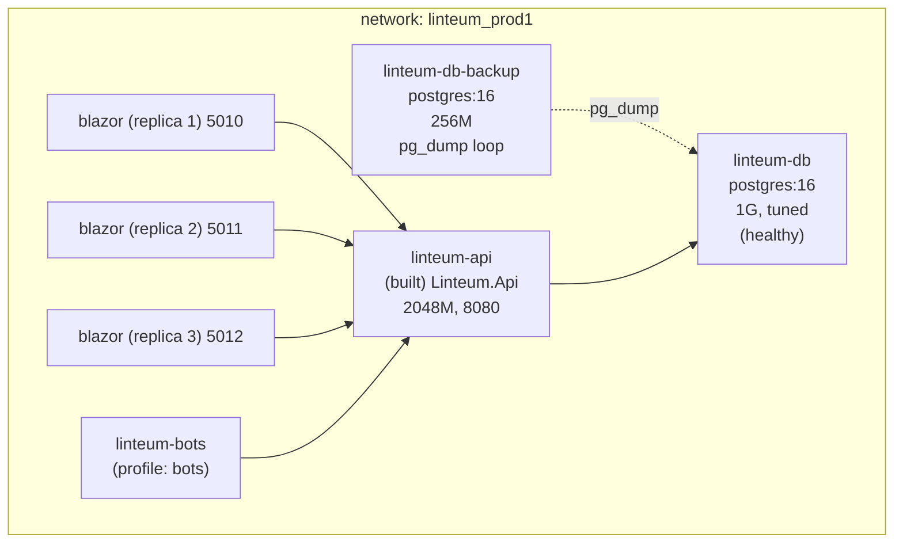

# Deployment

Linteum runs as a set of Docker containers on a single virtual server, deployed from the
development machine through a **remote Docker context**. This document describes the host, the
Compose topology, the deploy model, the resource budget, and backups.

> All facts below were obtained by **read‑only inspection** of the running production host
> (`ssh myvps`) at the time of writing — no containers were changed.

## 1. The host

| Property | Value                                          |
|---|------------------------------------------------|
| Provider hostname | `***`                                          |
| Public IP | `***` (`ssh myvps`)                            |
| OS | Debian GNU/Linux 13 (trixie), kernel 6.12      |
| CPU | 4 vCPU                                         |
| Memory | 7.8 GiB total (+ 4 GiB swap)                   |
| Disk | 251 GB (`/dev/vda4`, ~41 % used)               |
| Uptime at inspection | ~78 days                                       |
| Reverse proxy | nginx 1.26.3                                   |
| TLS | Let's Encrypt via Certbot 4.0.0 (nginx plugin) |
| Container runtime | Docker (Compose v2 plugin)                     |

The host is shared with three other small stacks (the `ash-twin` hub app, the monitoring stack,
and an unrelated `emojimental-spring`), all running as independent Docker Compose projects.

## 2. Deploy model: remote Docker context

The running containers' `com.docker.compose.project.working_dir` labels resolve to **Windows
paths** (e.g. `linteum-api → C:\Repos\GitHub\Linteum`), and there is **no Linteum source
checkout on the VPS filesystem**. This means the stack is deployed from the developer's Windows
machine using a **remote Docker context** (a `DOCKER_HOST` pointing at the VPS Docker daemon):

1. On the dev machine: `docker context use <vps-context>` (or `DOCKER_HOST=…`).
2. `docker compose up -d --build` — the build context is sent to the VPS daemon, images are
   **built on the VPS**, and containers are created there from the Windows repo's
   `docker-compose.yml` + `.env`.
3. Images and named volumes therefore live in the VPS daemon; the repo + `.env` live only on the
   dev machine.

`build-and-up.ps1` is a thin helper that runs `docker-compose build --no-cache` then
`docker-compose up` (foreground; uses the deprecated v1 `docker-compose` binary). The
`linteum_prod1` network is a named bridge created by Compose.

> Consequence: **the VPS has no Linteum `docker-compose.yml` or `.env` on disk.** Re‑deploying
> or rotating secrets requires the Windows repo + `.env`. This is an operational single point of
> context (see [Problems.md](Problems.md) — P‑OPS‑01).

## 3. Compose topology

`docker-compose.yml` defines six services on one bridge network (`linteum_prod1`):



| Service | Image | Limit | Ports | Notes |
|---|---|---|---|---|
| `linteum-db` | `postgres:16` | 1 G | `5434:5432` | `shm_size 256M`; tuned `shared_buffers=256MB`, `work_mem=4MB`, `effective_cache_size=768MB`, `max_connections=100`; healthcheck `pg_isready`. Volume `db_data`. |
| `linteum-db-backup` | `postgres:16` | 256 M | — | Daily `pg_dump -Fc` → `daily.dump`; weekly copy → `weekly.dump` on `WEEKLY_BACKUP_WEEKDAY`; healthcheck flags stale/failed dumps. Volume `db_backups`. |
| `linteum-api` | built `Linteum.Api` | 2048 M | `8080:8080` | EF connection pool 40 max / 4 min; `depends_on db [healthy]`; **no healthcheck**. |
| `blazor` ×3 | built `Linteum.BlazorApp` | 394 M each | `5010-5012:8090` | `deploy.replicas: 3`; shared `blazor_keys` volume (Data Protection); `depends_on api` (no health gate). |
| `linteum-bots` | built `Linteum.Bots` | 256 M | — | `profiles: [bots]` — opt‑in; no default command; `restart: on-failure` (run one-shot via `run --rm`). |

The API connection string is injected with `Maximum Pool Size=40;Minimum Pool Size=4;Timeout=30;
Command Timeout=30`. CORS origins are `CorsOrigins__0` (localhost) and
`CorsOrigins__1` (`http://blazor:8090`). See [Networking-and-TLS.md](Networking-and-TLS.md) for
how traffic reaches the Blazor replicas.

## 4. Live state at inspection

| Container | Memory used / limit | Notes |
|---|---|---|
| `linteum-db` | **478 MiB / 512 MiB (93 %)** ⚠️ | Running right at the limit — see P‑OPS‑04. |
| `elasticsearch` | 1.40 GiB / 1.5 GiB (93 %) | Monitoring stack; heap `-Xms512m -Xmx512m`. |
| `kibana` | 545 MiB / 1 GiB | |
| `linteum-api` | 281 MiB / 2 GiB | Comfortable headroom. |
| `linteum-blazor-{1,2,3}` | ~110–126 MiB / 394 MiB | ~28–32 %. |
| `filebeat` | 72 MiB / 256 MiB | |
| `linteum-db-backup` | 10 MiB / 256 MiB | |

- Deployed **`VERSION=0.2.2`** (confirmed in the Blazor container env).
- Blazor `ApiBaseUrl=http://linteum-api:8080`, `HUB_LINK=ash-twin.com`.
- Postgres data volume: **5.7 GB** on disk (≈ 528 MB compressed in `pg_dump -Fc`).
- **Docker disk:** 25 GB images, ~11 GB volumes, and **~50 GB of reclaimable build cache**
  (`docker builder prune` reclaims most of it — a scheduled prune lives at
  `scripts/maintenance/prune-docker-build-cache.sh`, see [§7](#7-routine-operations) — P‑OPS‑06).

## 5. Environment & secrets

Variables come from the dev‑machine `.env` (template in `.env.example`). Key groups:

- **Database:** `POSTGRES_USER/PASSWORD/DB`, `DB_CONTAINER_NAME/PORT`, `DB_HOST_PORT`.
- **App/admin:** `MASTER_PASSWORD` (required, startup guard), `MASTER_USER`, `MASTER_EMAIL`,
  `PASSWORD_SALT`.
- **Google OAuth:** `GOOGLE_CLIENT_ID/SECRET`.
- **Containers/ports:** `API_*`, `BLAZOR_*`.
- **Logging/runtime:** `NLOG_CONSOLE_MIN_LEVEL`, `VERSION`, `HUB_LINK`.
- **Backup (consumed but not in `.env.example`):** `TZ`, `WEEKLY_BACKUP_WEEKDAY`,
  `BACKUP_INITIAL_DELAY_SECONDS`.

> ⚠️ Secrets are passed as **plain environment variables** (visible via `docker inspect`); there
> is no Docker secrets/vault integration (P‑SEC‑12). The DB is also published on a host port
> (`5434`) and the API on `8080`, both reachable directly, bypassing nginx (P‑NET‑03/04).

## 6. Backups

The `linteum-db-backup` container runs a self‑contained loop (verified working):

- ~every 24 h: `pg_dump -Fc` to a temp file, then atomic `mv` to `/backups/daily.dump`.
- On `WEEKLY_BACKUP_WEEKDAY` (default Sunday): copy `daily.dump` → `weekly.dump` via temp+`mv`
  (crash‑safe — a failure never clobbers a good weekly).
- `pg_dump.log` captures stderr (0 bytes = no errors at inspection).

At inspection: `daily.dump` 528 MB (yesterday), `weekly.dump` 528 MB (previous Sunday). There is
**no retention beyond daily+weekly** and **no off‑host copy**.

> **Failure alerting (P‑OPS‑07):** the loop now writes `/backups/.last-success` and
> `/backups/.last-failure` markers, and the `linteum-db-backup` container has a `healthcheck` that
> reports **unhealthy** when no successful dump has landed within 25 h (24 h cycle + slack) — so a
> persistently failing `pg_dump` is surfaced instead of silently skipping backups. Wire that
> healthcheck into your existing monitor (`docker ps`, a healthcheck watcher, or Uptime-Kuma).

> **Off‑host copy (P‑OPS‑07, operational follow‑up):** the dumps still live only in the on‑host
> `db_backups` volume — losing the host loses all backups. Ship them off‑host from a host cron that
> runs after the daily dump, e.g. with rclone to object storage (a separate failure domain):
> ```bash
> docker run --rm -v db_backups:/backups -v "$HOME/.config/rclone:/config/rclone" \
>   rclone/rclone:latest copy /backups/daily.dump remote:linteum-backups/$(date +%F)/
> ```
> (`rclone config` once to define `remote`; rotate old dated dirs as needed.)

## 7. Routine operations

| Task | Command (from the Windows repo) |
|---|---|
| Deploy / rebuild | `docker compose up -d --build` (with the VPS context active) |
| Include bots | `docker compose --profile bots up -d --build` |
| Run a one‑off bot | `docker compose run --rm linteum-bots xerox home home.jpg` |
| Tail API logs | `docker logs -f linteum-api` (or via Kibana — see [Observability.md](Observability.md)) |
| Restore a backup | `docker cp daily.dump linteum-db:/tmp && docker exec linteum-db pg_restore …` |
| Prune build cache | `scripts/maintenance/prune-docker-build-cache.sh` (run on the VPS; weekly cron — P‑OPS‑06) |
| Renew TLS | Automatic via `certbot.timer` (see [Networking-and-TLS.md](Networking-and-TLS.md)) |

> The bots `profile` + `restart: on-failure` + no default command means enabling the profile with
> `up` (rather than `run --rm`) starts a container that prints usage and exits 0 — `on-failure`
> does **not** restart a clean exit, so it no longer restart-loops (P‑OPS‑05). A bot that crashes
> (non-zero exit) still restarts; run bots one-shot with `docker compose --profile bots run --rm`.
