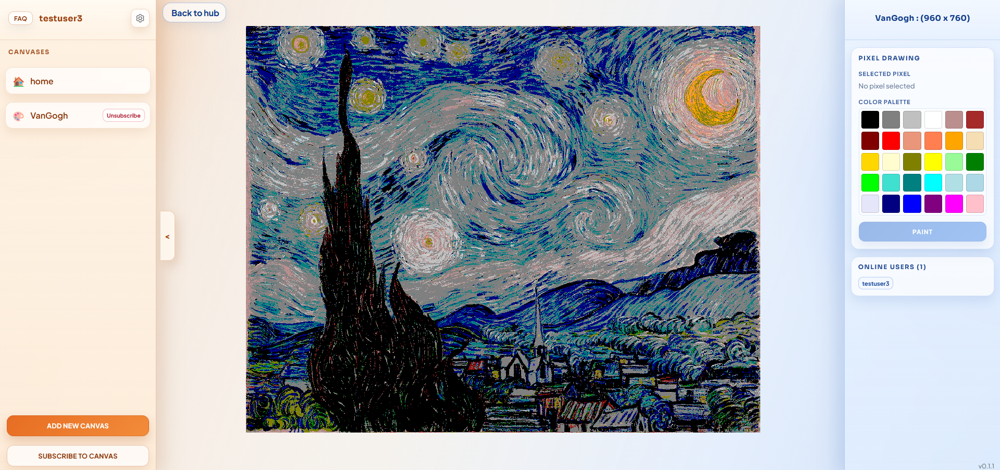

# 🎨 Linteum

Welcome to **Linteum**, a real-time collaborative canvas where you can draw, create, and watch art happen live with friends (and bots)! 🖌️✨

Check out the live website: [linteum.ash-twin.com](https://linteum.ash-twin.com)



---

## 🔥 Features

- **Real-time Collaboration:** See every pixel change instantly across all clients using SignalR.
- **Multiple Canvases:** Join existing canvases or create your own masterpiece.
- **Bot Support:** Dedicated bots like `VanGoghBot` and `CleanerBot` to help maintain (or decorate) the canvases.
- **User Authentication:** Simple signup or Google Login integration.
- **Dockerized:** Easy to deploy and run anywhere.

---

## 🏗️ Architecture & Tech Stack

Linteum is built with modern .NET technologies and a clean, decoupled architecture:

- **Frontend:** [Blazor](https://dotnet.microsoft.com/en-us/apps/aspnet/web-apps/blazor) (Interactive Server mode) for a rich, responsive UI.
- **Backend:** [ASP.NET Core Web API](https://dotnet.microsoft.com/en-us/apps/aspnet/apis) providing a robust HTTP-based API.
- **Real-time:** [SignalR](https://dotnet.microsoft.com/en-us/apps/aspnet/signalr) for ultra-low latency pixel updates.
- **Database:** [PostgreSQL](https://www.postgresql.org/) managed with [Entity Framework Core](https://learn.microsoft.com/en-us/ef/core/).
- **Containerization:** [Docker](https://www.docker.com/) & Docker Compose for seamless environment management.

### Project Breakdown

- `Linteum.Api`: The heart of the system, handling data, logic, and SignalR hubs.
- `Linteum.BlazorApp`: The user-facing web application.
- `Linteum.Bots`: Automated clients that interact with the API to paint or clean.
- `Linteum.Domain`: Core business logic and database entities.
- `Linteum.Infrastructure`: Data access layer and repository implementations.
- `Linteum.Shared`: Common DTOs and utilities used by all services.

---

## 🚀 Getting Started

### Prerequisites

- [Docker Desktop](https://www.docker.com/products/docker-desktop/)
- [.NET 8 SDK](https://dotnet.microsoft.com/download/dotnet/8.0) (if running locally without Docker)
- PowerShell (for the build script)

### Running with Docker

The easiest way to get Linteum up and running is using the provided script:

```bash
docker-compose up -d --build
```

### Environment Variables

Before running, make sure to set up your `.env` file or environment variables as defined in `docker-compose.yml`. Key variables include:
- `POSTGRES_USER`, `POSTGRES_PASSWORD`, `POSTGRES_DB`
- `MASTER_PASSWORD`, `MASTER_USER`, `MASTER_EMAIL` (for initial admin setup)
- `GOOGLE_CLIENT_ID`, `GOOGLE_CLIENT_SECRET` (optional, for Google Auth)

---

## 🤖 Meet the Bots

Linteum isn't just for humans! We have several bots that can be activated:
- **VanGoghBot**: Paints "Starry Night" onto the canvas pixel by pixel.
- **CleanerBot**: Helps keep the canvas tidy.
- **MunchBot**: Likes to add a little "Scream" to the mix.
- **XeroxBot**: Draws an image on the canvas.
- See DockerCheatSheet.md for more details on how to activate bots.
---

## 🤝 Contributing

We're in early development, and we'd love your help! Feel free to open issues, submit PRs, or just share your art.

Happy drawing! 🎨✨
